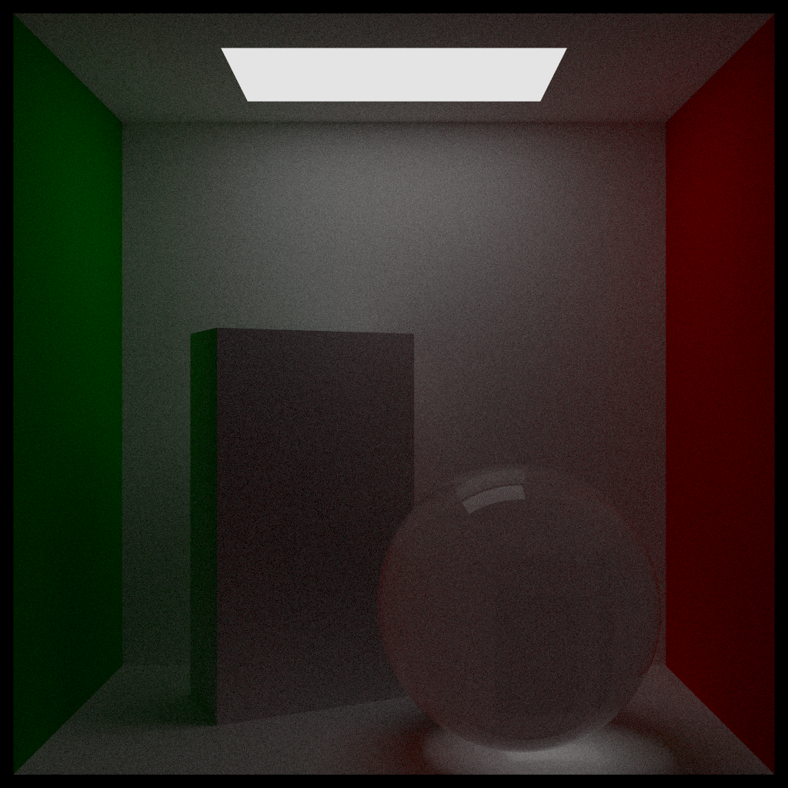
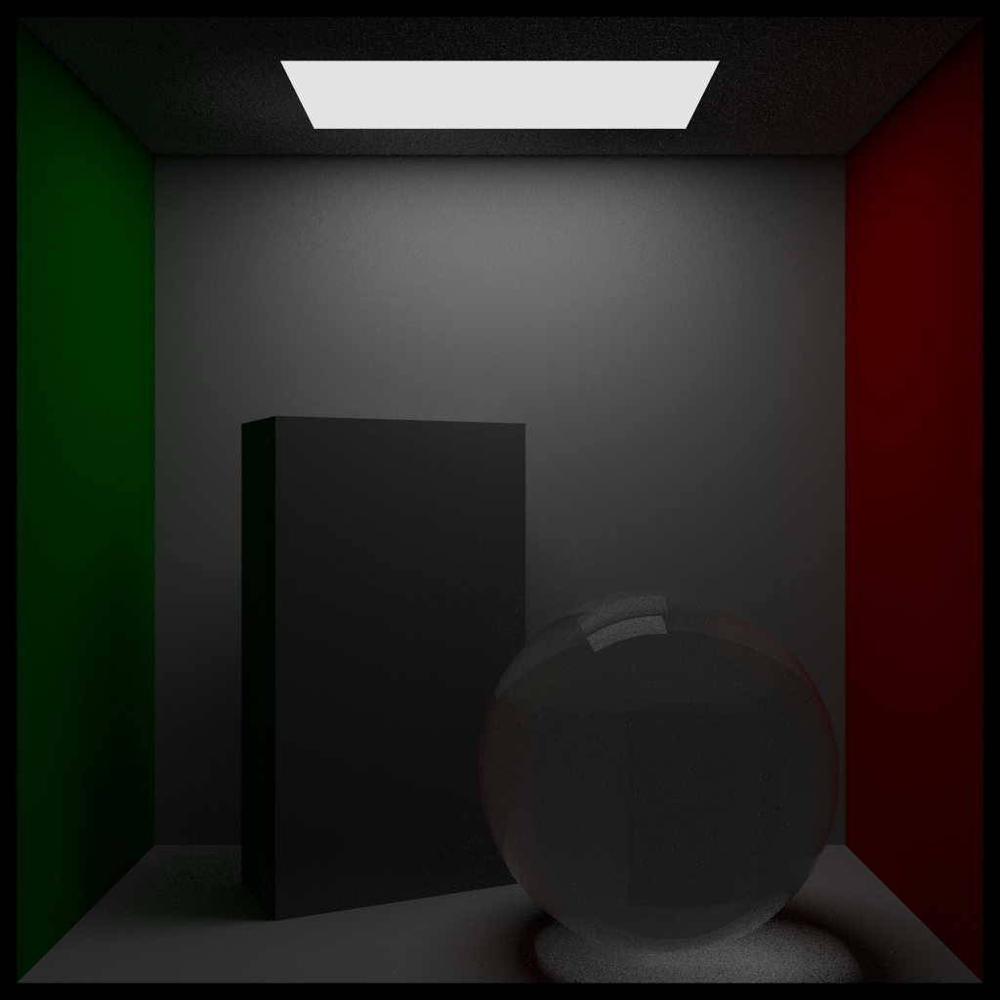
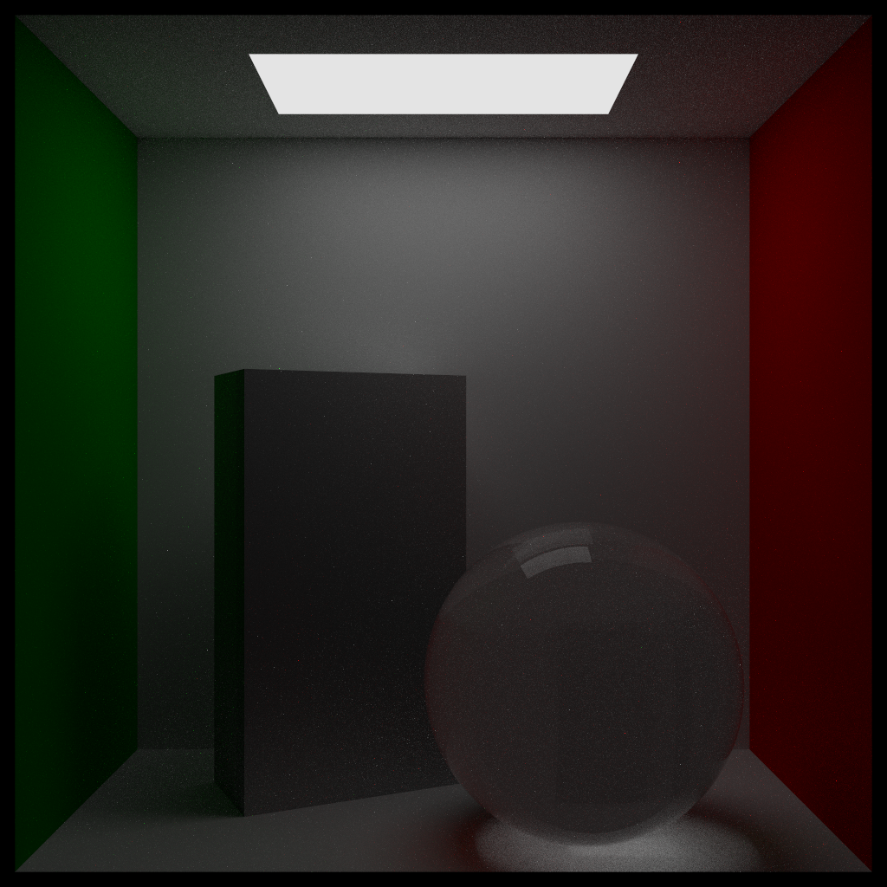
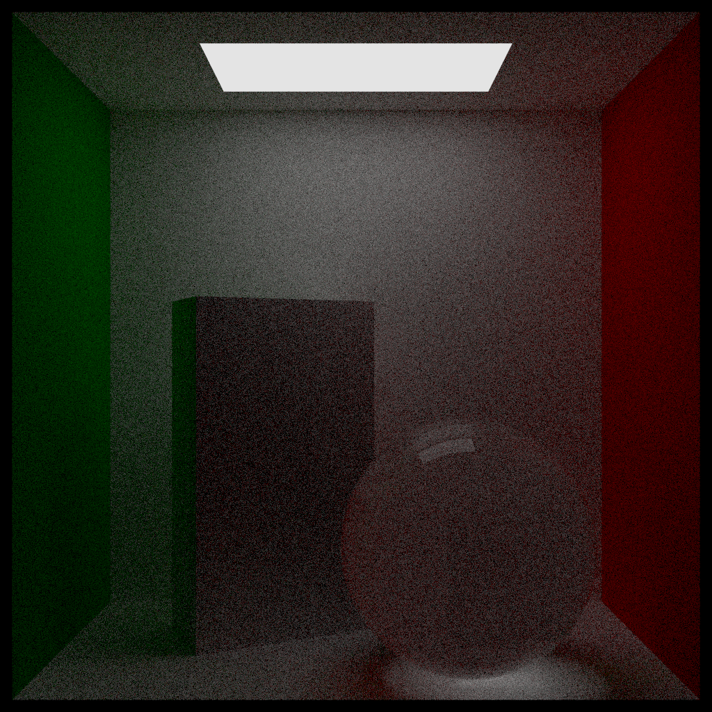
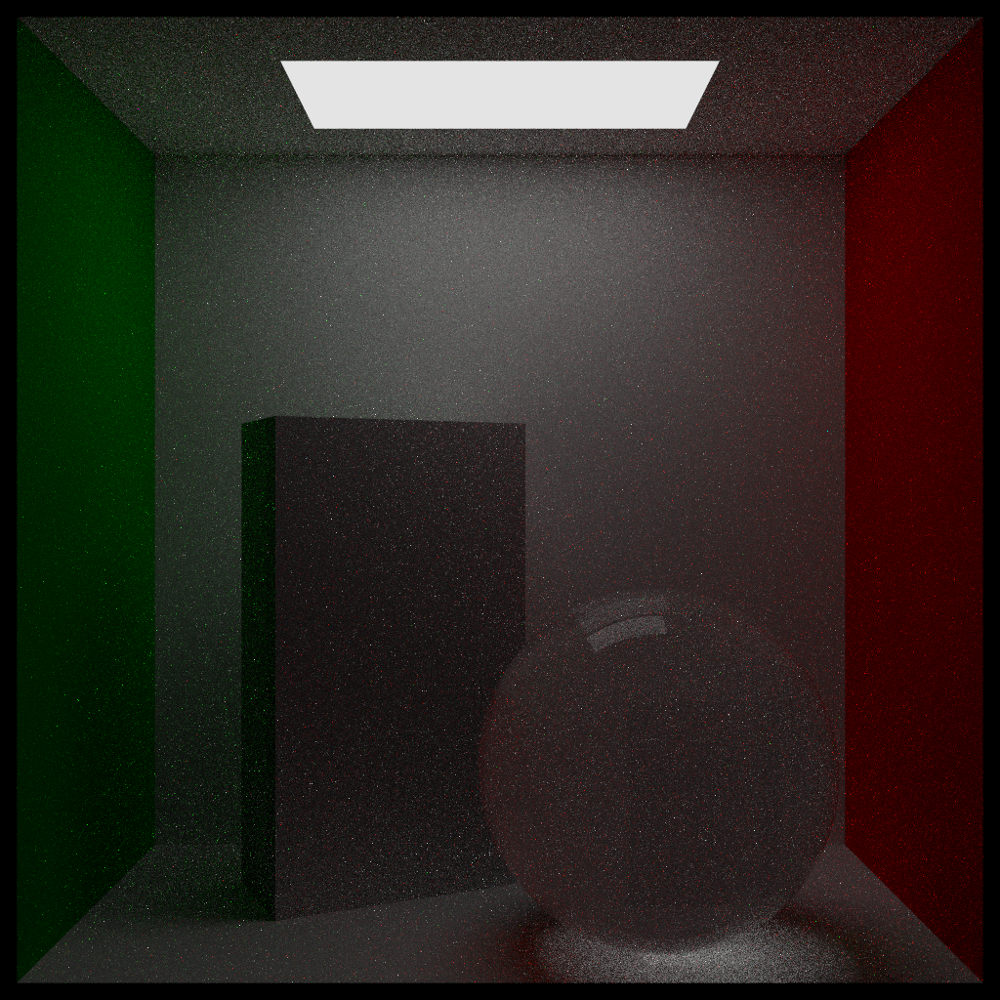

# Raytrace Monte Carlo

The goal of this project is to implement the techniques we have learned so far to the study of light transport. The focus in this project was almost entirely towards applications, with the vast majority of time and effort expected to be allocated to understanding how to translate theoretical concepts from class to code in light transport and writing/debugging the corresponding code. The particular element that will be of focus will be multiple importance sampling. Metropolis MCMC techniques is also provided as a brief theoretical presentation, but the implementation only includes MIS. All the code for the project is written in C++.

Report: [View](https://yashpatel5400.github.io/files/light_transport_mis.pdf)

Slides: [View](https://bit.ly/33epELB)

## Results
To obtain results, run the following command (modifying parameters as you see fit):

```
~/Library/Developer/Xcode/DerivedData/raytrace-gjxqcprnafljbggckftjjiqfwzbd/Build/Products/Debug/raytrace --filename /Users/yppatel/Documents/PhD_Year1_Fall/STATS_608/raytrace-montecarlo/test2.ppm --width 700 --height 700 --samples 4000 --bounces 100
```

### No MIS (1000 spp)
This is the scene rendered **without** MIS ($\alpha = \beta = 0$). Notice that it captures a great deal of the desired details in the lighting of the scene, particularly in the reflection of the walls onto the respective pieces of geometry in the scene, both visible in the green left side of the prism and the general green halo in the back left corner. This is similarly visible in the red highlights on the left side of the glass ball. On the other hand, clearly the picture is quite grainy, even having rendered with 1000 samples per pixel, which takes roughly two hours to render on a Macbook Air. This graininess is what we sought to fix with MIS, in the same number of samples per pixel.



### Only Light Sampling (1000 spp)

Here, we **only** sample from the light source to contrast the result with the previous results. Notice that, since there is no random scattering, two large differences emerge: the image is far crisper but all the nuances of scattering are no longer in the picture. The latter point is most noticeable in the lack of green highlighting on the left side of the box and the disappearance of the halo in that area. Similarly, there is no red reflection through the glass ball. To alleviate this total loss of fidelity in reconstruction, we wish to do the full MIS, as shown in the following result. This result was also obtained using 1000 samples per pixel.



### Combined (MIS) Sampling (1000 spp)

Here, we use $\alpha = 0.4, \beta = 0.3$, meaning we wish to mix both the vanilla flat rendering in the pure light source sampling case with the nuanced version in the hemispheric scattering case. Here, we in fact do get both desired features, in that we have a crisp final render, while also retaining the green halo effect near the box and the red reflectance through the glass ball. This, therefore, demonstrates how MIS can be used to greatly accelerate convergence of the render of a scene, where we used 1000 samples per pixel once again here.



### No MIS (50 spp)

We can re-run the above experiments with lower samples per pixel to highlight the rate of convergence even more. Here, we are doing **no MIS** with 50 samples per pixel and see a \textbf{huge} amount of grain in the rendered image.



### MIS (50 spp)

On the other hand, running **with MIS** with 50 samples per pixel and produces a fairly reasonable image. This demonstrates how much faster the convergence is using an MIS approach and what utility it provides for artists doing protyping renders for films.



## Future Steps:
(1) Implement Metropolis Light Transport